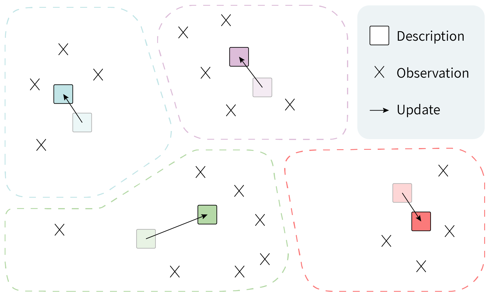

## From Zero to Hero: Cold-Start Anomaly Detection

Official PyTorch Implementation of [**"From Zero to Hero: Cold-Start Anomaly Detection"**](https://arxiv.org/) (ACL 2024).


## Cold-Start Anomaly Detection 

The cold-start setting provides two types of guidance: 

1. A textual description of each normal class, serving as initial guidance, such as predefined topic names in chatbot systems.
2.  A stream of _t_ contaminated observations (that may include anomalies), e.g., real user queries. 

It is particularly relevant in real-world applications where, shortly after deployment, a short stream of user queries becomes available but the queries are not labeled into intent types and some of them are out-of-scope. 

## ColdFusion



ColdFusion effectively adapts the zero-shot anomaly detector to contaminated observations.

## Installation
Create a virtual environment, activate it and install the requirements file:
```
virtualenv -p /usr/bin/python3 venv
source venv/bin/activate
pip install -r requirements.txt
```

## Usage
### 2.1 Feature Extraction
```
python extract_features.py [--dataset] [--model]
```

### 2.2 Evaluation
Finally, you can evaluate by running the following command:
```
python coldfusion.py [--dataset] [--model]
```

## Citation
If you find this useful, please cite our paper:
```

```
